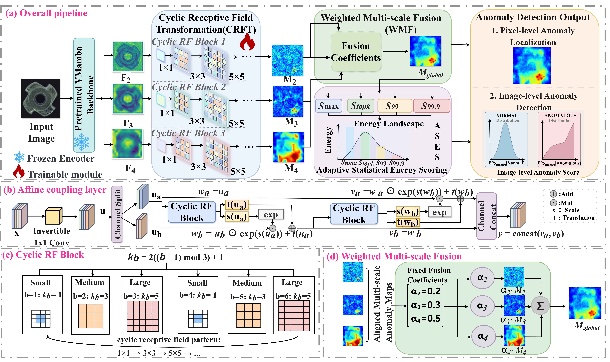

# CyG-Flow



**CyG-Flow: Cyclic Receptive Field Normalizing Flow for Industrial Anomaly Detection**

[Paper]() | [Code](https://github.com/Florapr/CyG-Flow)

## Introduction

PyTorch training and evaluation code for **CyG-Flow** on industrial anomaly detection benchmarks (**MVTec AD**, **BTAD**, and **VisA**), with a frozen **Vision Mamba** encoder (`vssm_small`).

CyG-Flow models normal feature distributions with invertible normalizing flows. The method introduces:

- **CRFT** — Cyclic Receptive Field Transformation across consecutive coupling blocks
- **WMF** — Weighted Multi-scale Fusion of hierarchical anomaly maps
- **ASES** — Adaptive Statistical Energy Scoring for image-level detection

Pipeline overview: frozen backbone → normalizing flow → multi-scale fusion → scoring (see figure above).

On MVTec AD, CyG-Flow achieves **99.6%** Image-AUROC (paper result).

## Get Started

> **Not included in this repo:** after `git clone`, separately clone [VMamba](https://github.com/MzeroMiko/VMamba) into `VMamba/` and download the `vssm_small` checkpoint (steps 3–4). Training and evaluation require both.

### Environment

**Python 3.10+**. Optional Conda env:

```bash
conda create -n cygflow python=3.10 -y
conda activate cygflow
```

**1. PyTorch** — install a build that matches your CUDA (example: CUDA 11.8):

```bash
pip install torch torchvision torchaudio --index-url https://download.pytorch.org/whl/cu118
python -c "import torch; print(torch.__version__, torch.cuda.is_available())"
```

Other CUDA versions: [pytorch.org](https://pytorch.org).

**2. Python dependencies** — from repo root:

```bash
pip install -r requirements.txt
```

Pinned packages are listed in `requirements.txt` (`timm==0.5.4`, `FrEIA`, `pyyaml`, `scikit-learn`, `fvcore`, etc.).

**FrEIA** — if `pip install -r requirements.txt` fails on git / GitHub timeout:

```bash
pip install "https://github.com/VLL-HD/FrEIA/archive/1779d1fba1e21000fda1927b59eeac0a6fcaa284.tar.gz"
pip install timm==0.5.4 "pyyaml>=6.0" "scikit-learn>=1.0.0" "numpy>=1.21.0" "Pillow>=9.0.0" fvcore packaging
```

**3. VMamba** — clone under `VMamba/` and build `selective_scan` on Linux when using the CUDA extension (see [VMamba](https://github.com/MzeroMiko/VMamba)):

```bash
git clone https://github.com/MzeroMiko/VMamba.git VMamba
```

On Windows you can use a directory junction: `mklink /D VMamba D:\path\to\VMamba`.

**4. VMamba pretrained weights (required)** — CyG-Flow uses a **frozen VMamba** encoder (`vssm_small`, ImageNet-1K). The checkpoint is **not** included in this repo; download the official VMamba release and save as:

```
vim_small_midclstok/vssm_small_0229_ckpt_epoch_222.pth
```

| Item | URL |
|------|-----|
| **vssm_small checkpoint (default)** | https://github.com/MzeroMiko/VMamba/releases/download/%23v2cls/vssm_small_0229_ckpt_epoch_222.pth |
| All VMamba classification weights | https://github.com/MzeroMiko/VMamba#classification-on-imagenet-1k |

```bash
mkdir -p vim_small_midclstok
wget -O vim_small_midclstok/vssm_small_0229_ckpt_epoch_222.pth \
  "https://github.com/MzeroMiko/VMamba/releases/download/%23v2cls/vssm_small_0229_ckpt_epoch_222.pth"
```

Or set an absolute path in the config:

```yaml
vssm_ckpt: /path/to/vim_small_midclstok/vssm_small_0229_ckpt_epoch_222.pth
```

### Data

#### MVTec AD

Download from [MVTec AD](https://www.mvtec.com/company/research/datasets/mvtec-ad/).

Use the original folder layout (`<category>/train/good/`, `<category>/test/`, etc.). Pass the dataset root to `--data`.

BTAD and VisA follow the same train/test split convention; point `--data` to the corresponding root when extending the loader.

### Training settings (paper)

Default hyperparameters match the paper unless overridden by environment variables or config:

- Image size `256`, flow steps `K=8`, batch size `16`
- Adam, learning rate `1e-3`, weight decay `1e-3`, `500` epochs
- Seeds `42`–`44` (results averaged over three runs)
- One model per category, trained on normal samples only
- No additional anomaly-map post-processing

### Reproducibility

Training uses `--seed` (default `42`) and an optional `--deterministic` flag:

```bash
--seed 42 --deterministic
```

Hyperparameters are fixed in `configs/vssm_small_vmamba.yaml`.

### Run

#### Train (single category)

```bash
python main_vmamba.py \
  -cfg configs/vssm_small_vmamba.yaml \
  --data /path/to/mvtec \
  -cat bottle \
  --gpu 0 \
  --seed 42 \
  --deterministic \
  --results-csv vmamba_mvtec_summary.csv
```

#### Train (all 15 MVTec categories)

```bash
python main_vmamba.py \
  -cfg configs/vssm_small_vmamba.yaml \
  --data /path/to/mvtec \
  -cat all \
  --gpu 0 \
  --seed 42 \
  --deterministic \
  --results-csv vmamba_mvtec_summary.csv
```

#### Eval only

```bash
python main_vmamba.py \
  -cfg configs/vssm_small_vmamba.yaml \
  --data /path/to/mvtec \
  -cat bottle \
  --gpu 0 \
  --eval
```

Checkpoints and CSV summaries are written under `CYG_CHECKPOINT_DIR` (default: `_cyg_experiment_checkpoints`) and `_bg_runs/vmamba_per_category/`.

## Acknowledgement

Thanks to [VMamba](https://github.com/MzeroMiko/VMamba) and [FrEIA](https://github.com/VLL-HD/FrEIA).

## License

All code in this repository is under the [MIT license](LICENSE).
